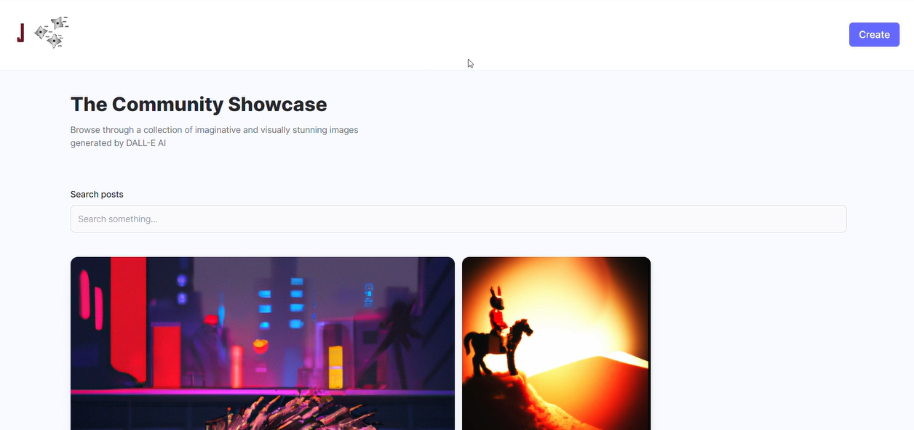

# AI-Imagery
A Full Stack MERN AI Image Generation App

AI Imagery is an innovative project that explores the world of artificial intelligence (AI) and its creative applications. This project aims to empower learners to build their own versions of AI tools that can generate various visual media, from memes and art to beautiful user interface (UI) and user experience (UX) designs.

The AI Imagery project is built on the powerful MERN (MongoDB, Express.js, React.js, and Node.js) stack, which is one of the most popular web development stacks in the industry. Additionally, it utilizes the Tailwind CSS framework, which is a modern utility-first CSS framework that simplifies the development process.

One of the key components of the AI Imagery project is the OpenAI DALL-E model, which is a cutting-edge deep learning model that generates images from text input. Another important component is Cloudinary, which is a cloud-based image storage service that provides secure and scalable image management capabilities.

## Installation

To get started with AI Imagery, follow these simple steps:

1. Clone the repository:
git clone https://github.com/7Jay-Lee7/AI-Imagery.git

2. Install dependencies for both the client and server:
cd client && npm install
cd ../server && npm install

3. Create a .env file in the server directory and add your API keys for OpenAI, Cloudinary, and MongoDB:
OPENAI_API_KEY=your-openai-api-key
CLOUDINARY_CLOUD_NAME=your-cloudinary-cloud-name
CLOUDINARY_API_KEY=your-cloudinary-api-key
CLOUDINARY_API_SECRET=your-cloudinary-api-secret
MONGODB_URI=your-mongodb-uri

4. Start the development server:
cd ../server && npm start
cd ../client && npm run dev

## Usage
With the development server running, you can access the AI Imagery application by visiting http://localhost:5173 in your web browser. The application allows you to generate images using OpenAI's DALL-E model and store them in Cloudinary.

## Technologies
AI Imagery is built using the following technologies:

* Node.js
* Express.js
* MongoDB
* React.js
* Tailwind CSS
* OpenAI API
* Cloudinary API
* Vite

## License
AI Imagery is licensed under the MIT License, which allows you to use, modify, and distribute the code in any way you like. Feel free to use this project as a learning resource, showcase your skills to potential employers, or as inspiration for your next creative project.
